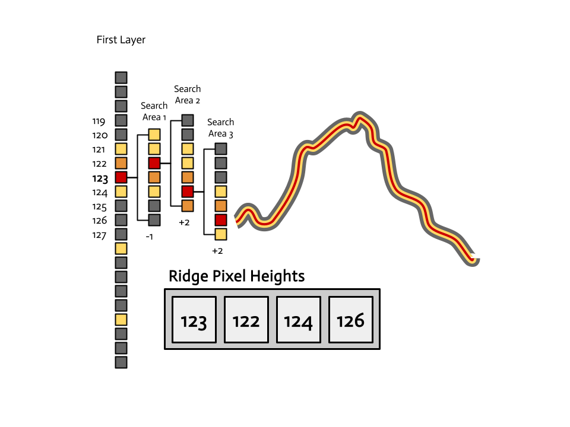

# Snowbowl Savant - HorizonSAGE Exploring an Adaptive Greedy Approach to Skyline Detection using Neural Networks
## Middlebury College, CSCI 701 (Senior Seminar, Spring 2025)
### Aidan McMillan & Lukka Wolff

**Goal:** Develop an open-source ridge detection algorithm for use in mountain peak identification applications

## Introduction
### 1. Context
Mountain identification apps like PeakFinder allow users to view annotated panoramas of surrounding peaks using their phone camera and sensor data. These apps typically align a synthetic view of the terrain, generated from Digital Elevation Models (DEMs), with the user’s live camera feed[^2]. However, sensor data (such as gyroscope and compass readings) can often be inaccurate, leading to visible misalignments between the rendered peaks and the actual mountain ridge line in the camera image[^2].

### 2. Motivation
Nature enthusiasts enjoy using identification apps to contextualize the world around them — but these apps aren't perfect. After using such applications we, like many others, were disappointed at the poor image alignment. So, we searched for ways it could be improved and found studies that proposed ridge detection as a means of improving the visual alignment of the DEM-based panorama with the true mountain skyline captured by the user's phone. Unlike sensor data, which can be noisy or drift over time, computer vision-based ridge detection can more precisely extract the mountain ridges that can then be paired with DEM data to enhance the in-app experience.

### 3. Previous Work
In 2017, Porzi et al. proposed their system for smartphone-based image-to-DEM alignment for mountain peak recognition mobile applications.[^2] Their learning-based edge detection (using Random Ferns) helped isolate mountain ridges, which were then aligned with synthetic panoramas derived from DEMs. Unlike apps like PeakFinder, which rely heavily on inertial sensors, their method demonstrates how visual ridge detection can help align reality and augmented overlays for more accurate mountain peak labeling.

Within this niche, research generally falls into two broad categories: (1) supervised learning methods and (2) semantic segmentation approaches.[^1] The first group includes techniques that learn to classify skyline vs. non-skyline pixels "using feature descriptors or directly discriminating based on the pixel intensities."[^1] These methods often formulate skyline detection as a shortest-path problem, solved with dynamic programming.[^3] Some approaches integrate edge information (like Canny or Sobel edges), while others employ classifiers such as Support Vector Machines (SVMs) or Convolutional Neural Networks (CNNs). Though accurate, these models are typically resource-intensive, making them impractical for real-time use on mobile platforms.

The second group treats skyline detection as a sky-segmentation task, leveraging deep learning networks pre-trained on scene parsing or semantic segmentation. These methods are effective but also suffer from high memory and computation demands, complicating their implementation for less powerful devices like smartphones, drones, or planetary rovers. To address these limitations, Ahmad et al. introduced a shallow learning framework in 2021 that uses local structure tensors on Canny edges to estimate ridge probability.[^1] This approach significantly reduced computational cost while still achieving reasonable accuracy. By avoiding deep architectures and minimizing feature extraction overhead, this approach is viable for skyline detection in resource-constrained environments like cell phones.

### 4. Gaps
Despite the extensive literature on ridge detection, there aren't many practical open-source efforts that implement ridge detection and integrate the technique into augmented reality mobile applications. The current gap is not just technical but also experiential: users face visible misalignment in apps like PeakFinder due to reliance on inaccurate sensor data. Ridge detection provides an opportunity to improve precision and accessibility while contributing to the open-source computer vision community. Moreover, in the realm of ridge detection research, the current implementations have room for improvement. Current frameworks that employ Canny and Dynamic Programming have to classify a large number of pixels and use costly algorithms to reconstruct the lines.

### 5. Your Work & Significance
Our work investigates whether a modified ridge detection algorithm can be effectively used for mountain skyline recognition, with the long-term goal of improving the accuracy of mountain labeling apps. By narrowing in on this component and releasing it openly, we aim to enable future developers to build better, more transparent, and more accurate nature-assistive tools. Specifically, we implement a novel greedy algorithm that constructs the predicted ridge line in parallel with ridge pixel classification. Our approach reduces the search space for the neural network classifier and eliminates the need for dynamic programming reconstruction.

## Methodology

Our approach focuses on training a lightweight ridge pixel classifier to evaluate a novel ridge-line reconstruction strategy based on greedy methods. We compare this strategy’s speed and accuracy against a traditional dynamic programming approach. Additionally, we evaluate different input feature sets, including grayscale and RGB pixel neighborhoods and structure tensor descriptors. The goal is to assess whether these models can detect mountain skylines both accurately and efficiently enough for deployment on mobile or embedded platforms.

### Data Collection & Annotation

We use the publicly available web dataset introduced by Ahmad et al. (IJCNN 2021), which contains 80 mountain panorama images with corresponding ground truth annotations. Each annotation is a `.bmp` image where mountain ridges are marked using pure red pixels. We manually split the dataset into 16 training images and 64 test images.

To generate training labels, red pixels are treated as positive ridge samples, and all other pixels are treated as negative. Since Canny edge detection does not always align perfectly with annotated ridge pixels, we apply binary dilation to the red mask. This helps accommodate small misalignments and ensures that nearby edge pixels are still labeled as positive during training.

Feature extraction is restricted to Canny edge pixels in order to reduce the negative class size and to focus the task on distinguishing ridge-line edges from non-ridge-line edges. This decision is also motivated by the dynamic programming baseline, which operates on Canny edges alone.

### Feature Extraction

The primary features are local pixel neighborhoods. Specifically, we extract small image patches centered around Canny edge pixels of size $7 \times 7$.

To improve feature richness, we incorporate local structure tensor descriptors, inspired by the BLADE filtering framework[^4]. These are derived from the $2 \times 2$ structure tensor matrix at each pixel, smoothed using a Gaussian kernel, and decomposed into its eigenvalues and eigenvectors.

From the structure tensor, we compute the following descriptors at each pixel:

* **Orientation**:

  $$
  \theta = \arctan\left(\frac{w_2}{w_1}\right)
  $$

  where $\vec{w}$ is the dominant eigenvector. This indicates the dominant local gradient direction.

* **Strength**:

  $$
  \text{strength} = \sqrt{\lambda_1}
  $$

  where $\lambda_1 \geq \lambda_2$ are the eigenvalues. This quantifies the magnitude of the dominant directional signal.

* **Coherence**:

  $$
  \text{coherence} = \frac{\sqrt{\lambda_1} - \sqrt{\lambda_2}}{\sqrt{\lambda_1} + \sqrt{\lambda_2} + \varepsilon}
  $$

  This measures the anisotropy of the gradient, with higher values indicating a clearer directional preference.

We evaluated four feature configurations:

* **Gray\_noST**: Grayscale patch only
* **Color\_noST**: RGB patch only
* **Gray\_ST**: Grayscale patch + structure tensor features
* **Color\_ST**: RGB patch + structure tensor features

### Classifier Design and Training

We use a compact fully connected neural network with a single hidden layer of 16 ReLU units and a sigmoid output unit. This architecture was chosen for its speed, interpretability, and suitability for low-power platforms. The network is trained using binary cross-entropy loss and the Adam optimizer.

Training is performed on extracted feature vectors using PyTorch, over 5 epochs with a learning rate of 0.003.

### Ridge Reconstruction

After the classifier predicts per-pixel ridge probabilities, we reconstruct a continuous ridge-line using two methods:

#### Greedy Tracking

We introduce a lightweight greedy algorithm for ridge-line reconstruction that attempts to optimize for speed, making it suitable fo real-time detection on resource-constrained applications. This method integrates classification and reconstruction to minimize the number of model inferences required.

Observing that ridge lines often form visually coherent paths in the probability map, we designed the algorithm to "trace" the line across the image column-by-column:

1. Start by estimating the ridge height in the initial image columns.
2. For each subsequent column, define a vertical search window of radius $r$ centered on the current ridge estimate.
3. Evaluate ridge probabilities only within this narrow band.
4. Select the pixel with the highest probability as the ridge point for that column.
5. If confidence falls below a threshold, restart tracking from the first column.

This approach the global cost-map computation and backtracking required by dynamic programming, and should provide significant speed advantages while maintaining sufficient accuracy. The drawback to this approach is that it makes the assumption that there are no vertical or near edges in the mountain and that the ridge-line prediction map creates a continuous-enough line. This can lead to inaccuracies in prediction especially on edge-case images.

#### Dynamic Programming

As a baseline, we implemented a dynamic programming approach, commonly used for skyline detection. It formulates ridge detection as a shortest-path problem over a 2D cost map, where the cost at each pixel is:

$$
\text{cost} = -\log(p)
$$

where $p$ is the predicted ridge probability. The optimal path is traced left to right, under a vertical smoothness constraint $\delta$, which limits abrupt vertical transitions between adjacent columns.

Although DP yields accurate ridge reconstructions, it is more computationally intensive due to the need to evaluate, store, and backtrack across the full cost map. Furthermore, it relies on the prediction of a cost map over the entire image, meaning each pixel must be classified. Our DP approach counteracts this issue by only classifying only Canny edges. The issue that arises here is that 

### Evaluation Metrics

We evaluate ridge detection performance using the following metrics:

* **Average Pixel Distance**: Mean vertical deviation between the predicted ridge and the ground truth ridge.
* **Inference Time**: Average time required to reconstruct a ridge-line across an image.

## Results

We evaluated our ridge detection pipeline across four input configurations (grayscale vs. RGB, with and without structure tensor features) and two ridge construction methods (Dynamic Programming and our proposed Greedy Tracker). Performance was assessed using average vertical pixel distance and inference time in seconds. Keep in mind that our images had a height of 520 pixels.

| Configuration | Method | Avg. Pixel Distance   | Inference Time (s)   |
| ------------- | ------ | --------------------- | -------------------- |
| gray\_noST    | DP     | 1.62                  | 5.31                 |
| gray\_noST    | Greedy | 8.63                  | 0.26                 |
| color\_noST   | DP     | 0.89                  | 5.36                 |
| color\_noST   | Greedy | 10.99                 | 0.28                 |
| gray\_ST      | DP     | 1.59                  | 5.57                 |
| gray\_ST      | Greedy | 32.81                 | 0.28                 |
| color\_ST     | DP     | 0.90                  | 5.52                 |
| color\_ST     | Greedy | 20.65                 | 0.28                 |

Dynamic Programming consistently produced the most accurate ridge paths, with the best performance in the color\_noST configuration (0.89 pixels error). However, this came at a significant computational cost (\~5.5 seconds per image) that would not be feasible for real time detection.

In contrast, our Greedy Tracker reduced inference time by nearly 20×, running in under 0.3 seconds per image. While less accurate overall, the gray\_noST + Greedy combination achieved a reasonable trade-off (8.63 pixels error) with the fastest runtime, making it more viable for real-time or mobile applications. Based on the produced images, this higher error was produced by inaccuracies in a couple images while most images performed quite well. We hope that with better adaptive logic in the greedy algorithm and more training data (which would allow our classifier to generalize to more images), our algorithm would see significant improvements and achieve accuracies similar to that of the dynamic programming method.

## Ethics Statement
### Open-Source Rational
Conducting the research for this project, we were surprised to find no open-source code for apps like PeakFinder and limited code for mountain ridge detection. There are numerous scholarly papers on the subject that in many cases are inaccessible and or esoteric.

#### Possible Futures:
- **Positive**: future developers improve upon our algorithm
- **Positive**: future developers implement the algorithm into their own peak detection applications
- **Positive**: future developers reference the algorithm in adjacent projects 
- **Positive**: people use our implementation as a educational tool for computer vision, offering a hands-on alternative to abstract papers
- **Neutral**: our algorithm does not get used or referenced
- **Neutral**: our model’s accuracy is comparable to sensor-based methods, offering little improvement
- **Negative**: the detection algorithm gets easily repurposed to malicious or militarized ends
- **Negative**: our open-source work is co-opted by proprietary software without proper attribution

#### Stakeholders:
**Primary Stakeholders**
- Developers and Researchers
- App Users (hikers, tourists, mountaineers, hobbyists, etc.)
- Open-source contributors
- Future Students
**Secondary Stakeholders**
- Communities in Mountainous Regions *whose landscapes may be commodified or inaccurately represented*

#### Values at Play:
- Accessibility
    - Knowledge and tools should be usable by people across various levels of expertise
- Transparency and Integrity 
    - Open design clearly stated assumptions, and reproducibility are essential
    - Algorithms should not be misleading or overestimate their capacity

**Outcome Lens**
Will our algorithm meaningfully improve AR alignment in mountain peak recognition algorithms? Will it increase scientific or recreational engagement? Will it be used justly or unjustly? A positive outcome would increase usability for hikers, students, and developers; a negative one would involve militarized repurposing.

**Process Lens**
We are committed to an ethical development process — writing clear documentation, being open about limitations, citing sources, and avoiding shortcuts in evaluation. The process must also respect the boundaries of data use and academic integrity outlined in the code of conduct.

**Structure/Justice Lens**
Who benefits from this tool? We must reflect on structural inequities in access to high-tech educational and mapping tools. Open-sourcing our algorithm attempts to redistribute this access, but we must remain aware that computational literacy and internet access remain unevenly distributed. Thus, we intend to write accessible documentation and minimize reliance on frameworks that would require specialized hardware.

### Choices
When developing HorizonSAGE, we acknowledge that we are part of a larger group of research on skyline detection. Thus, we wanted to keep all of our code accessible, readable, and clear. So, after we finished our experiments in our Jupyter notebooks, we put all of our core functions in well‐documented Python files with docstrings for all functions. In our research, we performed comparisons between several different training approaches. We wanted to highlight accurate results with the different configurations. Our methods included training with structure tensor (ST) vs. no‐ST processing and training on RGB vs. grayscale inputs. So we have functions that compare these methods and produce visualizations for others to trace the impacts of different design choices, aligning with our emphasis on transparency and reproducibility.

### Limitations
Our approach has several inherent limitations: we assume that mountain silhouettes are continuous and unobstructed, which may not hold in cluttered or partially occluded scenes that are common in many mountain photos. Moreover, our mountain image dataset only contained 80 images, which, after performing a train-test split, left 64 images for training and 16 for evaluation. While this worked decently for our purposes, the small size of the dataset may have contributed to inaccuracies in our model. This also means that our conclusions and observations were drawn from a relatively small sample.

Our greedy algorithm’s adaptive‐restart mechanism can sometimes stray far from the true mountain ridgeline. Although restarts help recover from poor initial fits, they may also pick a new starting point that isn’t actually on the mountain silhouette. This happens when the line encounters a gap in the probabilistic ridge map: the next most likely pixel in the first column can lie well off the true ridge. Because we always restart from the first pixel column, the error propagates. We want other researchers to know about this limitation so they can judge whether our method fits their needs or can focus on researching more reliable restart strategies.

## Future Work
Looking forward, we have identified several areas of improvement and possible evolutions of our method. First, we would love to amass a larger dataset to hopefully improve the performance of our model and its generalizability. Next, we would like to develop an improved adaptive-restart mechanism that doesn't always restart from the first pixel column, but instead operates on a checkpoint-based system to avoid losing accurate parts of the ridgeline because of small probability gaps. We would love to develop several more adaptive restart methods and compare them. Finally, it would be a passion project to integrate this mechanism into a fully functional mountain identification application.

> We employed ChatGPT as a tool to proofread and improve the readability of this text

[^1]: Ahmad et al., *Resource Efficient Mountainous Skyline Extraction using Shallow Learning*, IJCNN 2021.   
[^2]: Porzi, L., Bulò, S.R., Lanz, O. et al. *An automatic image-to-DEM alignment approach for annotating mountains pictures on a smartphone*. Machine Vision and Applications 28, 101–115 (2017). https://doi.org/10.1007/s00138-016-0808-0
[^3]: Lie, Wen-Nung & Lin, Tom & Lin, Ting-Chih & Hung, Keng-Shen. (2005). *A robust dynamic programming algorithm to extract skyline in images for navigation*. Pattern Recognition Letters. 26. 221-230. 10.1016/j.patrec.2004.08.021. 
[^4]: Getreuer, P., et al. BLADE: Filter learning for general purpose computational photography. 2018 IEEE International Conference on Computational Photography (ICCP), (2018).

